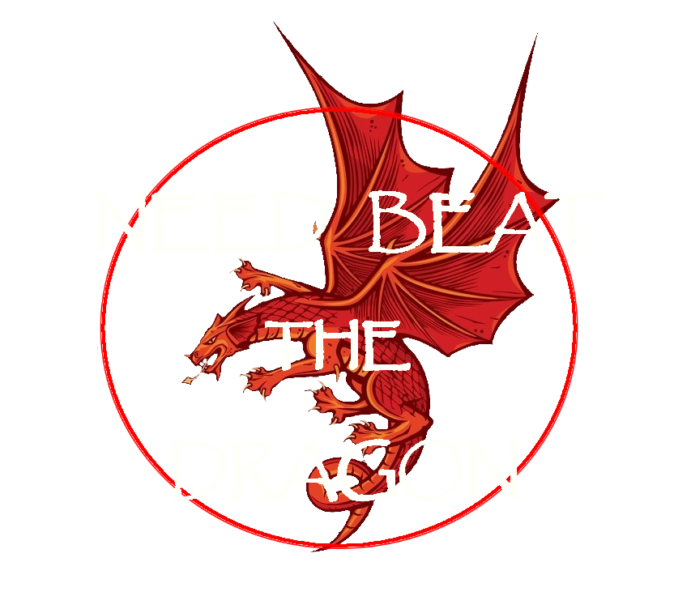
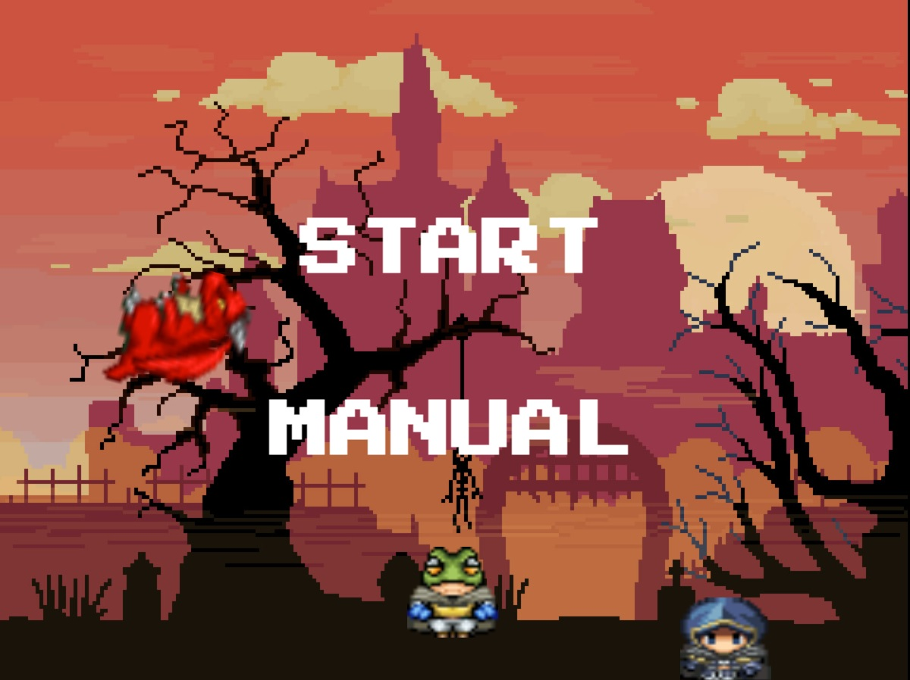
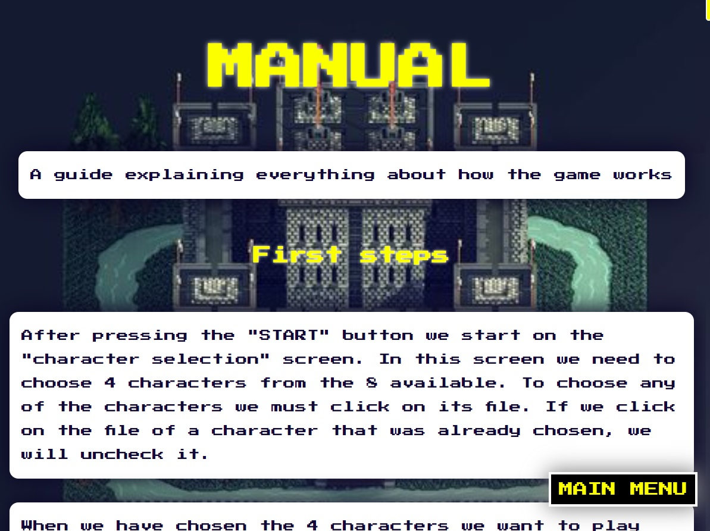
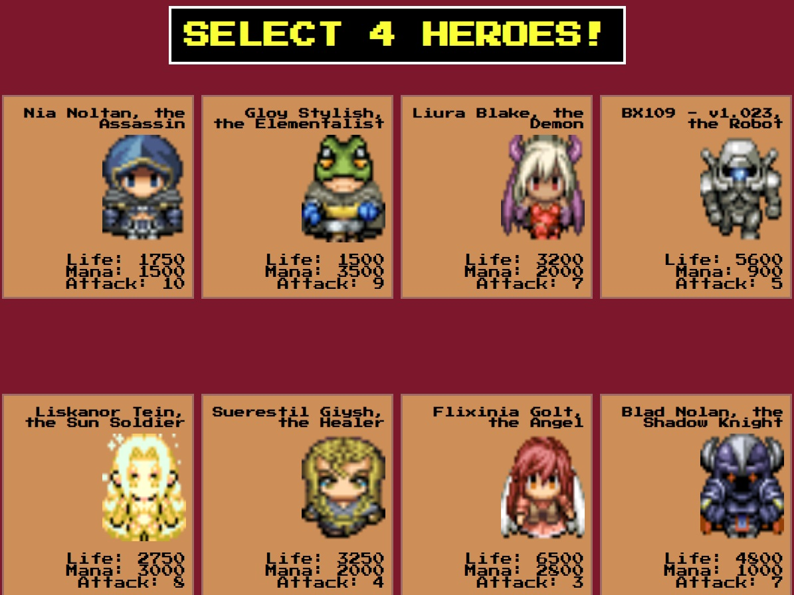
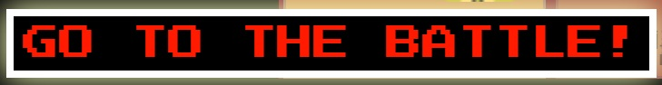
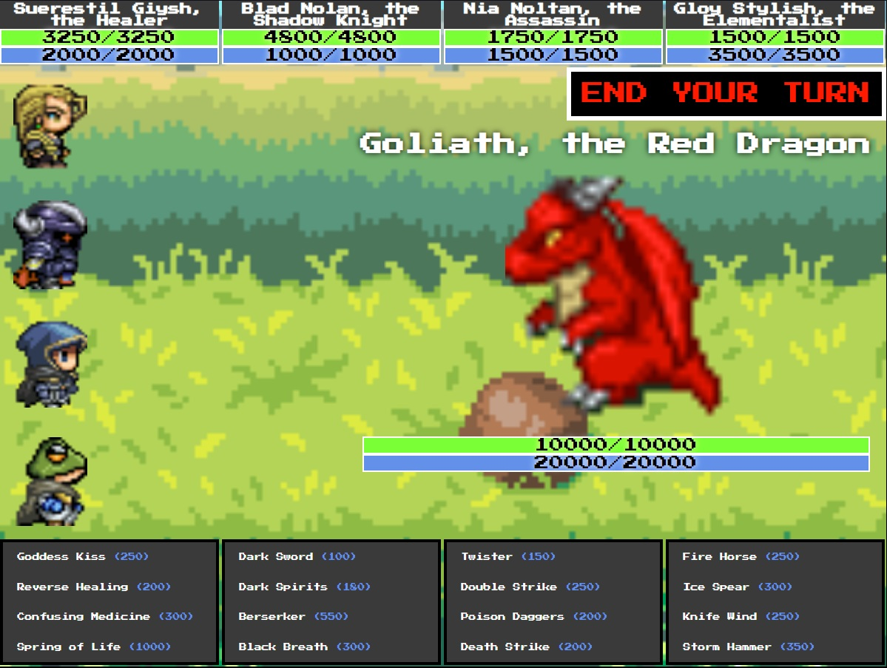
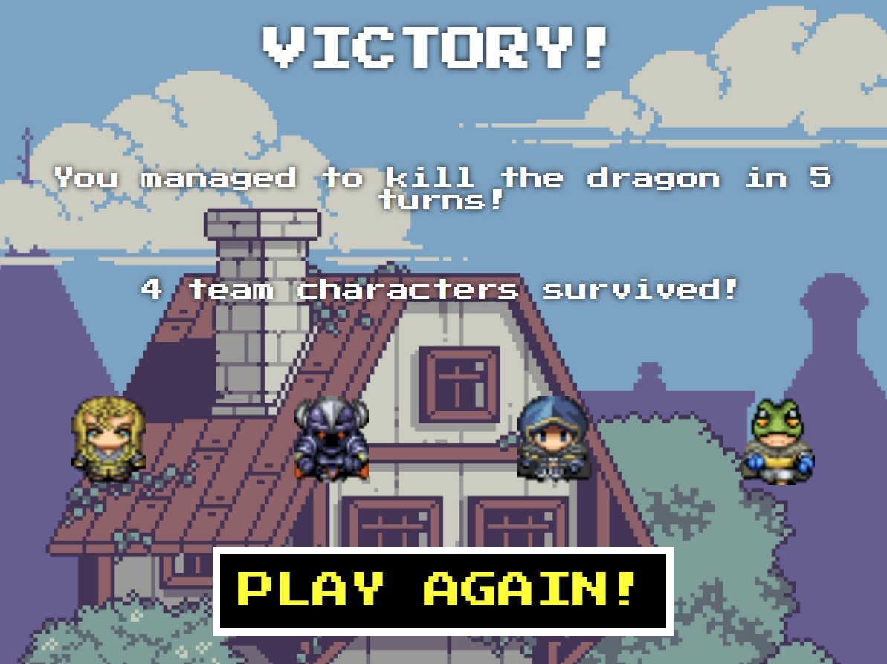
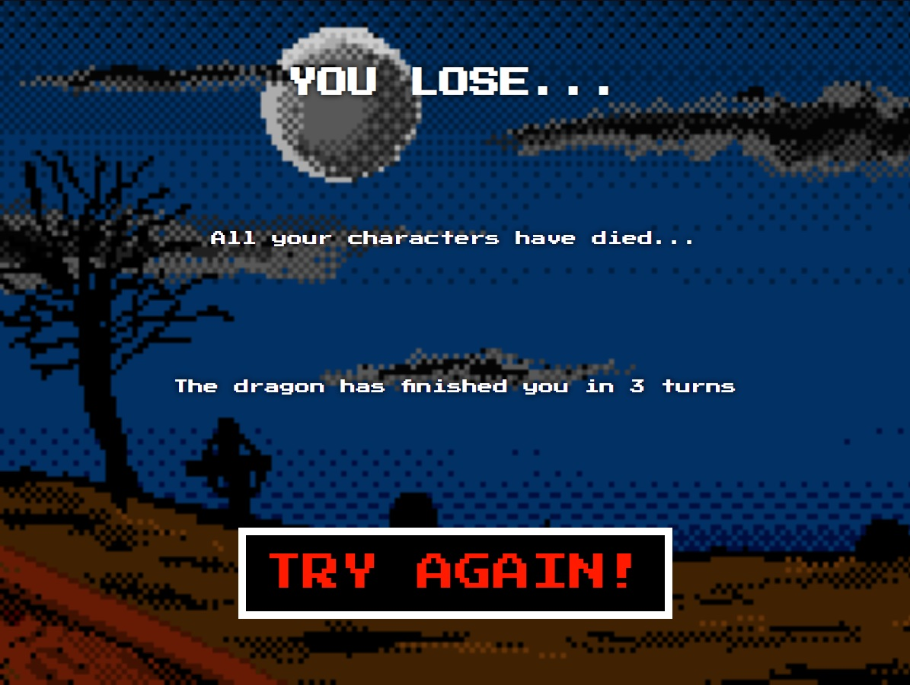

# Videojuego JS
## Realización de proyecto en academia Geeks Hubs Academy. Nos solicitan realizar un videojuego con JS creando e instanciando clases.
## Se usan para el proyecto las tecnologías HTML, CSS Y JS
<br>

# NEED BEAT THE DRAGON

Basándome en los juegos de RPG clásicos he decidido enfocar el proyecto hacia la temática "videojuego por turnos".
<br>
Procedo a explicar punto por punto el funcionamiento del videojuego:

* Se crean en el JS las clases `Skill` y `Character`. Se ha creado 8 objetos Character y 4 objetos Skill por cada personaje objetos Character creado.
***

* También se crea un objeto Character y 4 objetos Skill más, para crear al enemigo del juego.
***

* En la pantalla inicial aparece el logo del videojuego. Si se pulsa el logo se esconde el div que lo contiene con ```display:none;```y aparece la primera vista de la aplicación: **Menu Principal**, añadiendo ```display:flex;``` en el div correspondiente. Se usará este método para cambiar entre vistas durante toda la aplicación.
***

* En este **Menú Principal** se puede entrar al juego pulsando **START** o se puede acceder a la guía del juego pulsando **MANUAL**
***

* Si se decide entrar en manual, se cargará la vista **Manual**. Aquí se puede ver una guía del funcionamiento del juego (escrita directamente en el HTML), así como una explicación detallada de cada personaje y cada una de sus habilidades (para conseguir esto se hace desde el archivo JS, recorriendo el array que contiene a los personajes creados). Se puede volver al menú principal con el botón **MAIN MENU**.
***


*  Si se pulsa el botón **START** se accede a la vista **Selección Personajes**. En esta vista se mostrarán todos los personajes seleccionables para el juego. Desde el archivo JS es desde donde se crea cada tarjeta con la información y la imagen del personaje. Además, desde esa misma orden que pinta toda la información, también se introducen eventos ```onclick```, creados para poder guardar en un array los personajes que se vayan eligiendo. Si se clicka sobre un personaje elegido, se saca del array.
***


* Cuando hay 4 personajes seleccionados, aparece el botón **GO TO THE BATTLE!**, que hace aparecer la vista **Pantalla Juego**
***


* La vista **Pantalla Juego** es la más importante de la aplicación, donde tendrá lugar todo lo referente a la partida. En ella se cargan los siguientes puntos:
    * **Botón START YOUR TURN**: este botón hace visibles todos los elementos del DOM necesarios, resetea la información de las barras de salud y de mana, las imágenes de los personajes y las habilidades.
    * **Barras de salud y de mana**: se cargan recorriendo el array de personajes seleccionados. Las barras están configuradas para que sean de ```width``` variable, en función del porcentaje de salud o mana que se tenga (para tener presente siempre la salud y el mana máximos de cada personaje, estos valores se guardan en un array al comienzo de la partida). También el color de las barras es variable en función de si la vida o mana actual superan el 100% o no. A su vez, está configurado para que los valores de salud o mana nunca se muestren menores de 0. Todas estas características del aspecto visual se añaden desde el JS, a la vez que se agrega todo este contenido de manera dinámica.
    * **Imágenes de los personajes elegidos**: Se cargan las imagenes asociadas a cada objeto Character, recorriendo el array de personajes seleccionados.
    * **Datos del enemigo**: se cargan el nombre del enemigo, su imagen y sus barras de salud y mana. Adicionalmente se carga un div invisible, el cual contendrá información para algunas habilidades con mecánicas especiales.
    * **Habilidades de los personajes**: se recorre el array de personajes elegidos para mostrar en pantalla cada una de las habilidades de cada personaje. Se muestran el nombre de la habilidad y su gasto de mana. A su vez, se carga un div invisible con su descripcion y su daño base, que solo será visible si pasamos el ratón por encima de la habilidad. También hay añadido efecto ```:hover``` a los nombres de las habilidades. Cuando el personaje no tiene suficiente mana para lanzar la habilidad, está se vuelve menos opaca y pierde la capacidad para poder interactuar con eventos de ratón, haciendo imposible ser lanzada. Cada vez que se selecciona una habilidad, el cuadro donde están guardadas se vuelve menos opaco y pierde la capacidad de interactuar con eventos de ratón. De esta manera se hace que solo se pueda usar una habilidad de cada personaje por turno. Al seleccionar una habilidad, esta se guarda en un array. En este array, la habilidad se guarda en función de la posición que ocupe en el array de personajes seleccionados el personaje que tiene la habilidad (p.e.: si el personaje 2 usa una habilidad, esta se guardará en la posición 2 del array, aunque no hayan seleccionado aún habilidad los personajes anteriores). De esta manera se respetan los gastos de mana correctamente, y permite que no todos personajes usen sus habilidades, si así se desea, sin errores.
    * Cuando se decide que no se quiere elegir ninguna habilidad más, o ya se han elegido las 4 posibles, o no se pueden elegir ninguna por falta de mana, se pulsará el botón **END YOUR TURN**.
***

* El botón **END YOUR TURN** gestiona todos los cambios que suceden entre un turno y otro:
    * Gestiona la variable turnos, que lleva la cuenta de cuantos turnos se han hecho en la partida.
    * Recorre el array donde se guardaron las habilidades guardadas para este turno, y las va ejecutando por orden, creando un ```setTimeout``` a cada una de las habilidades. Este delay entre habilidades se gestiona con un contador.
    * Para la ejecución de las habilidades existe un filtro ```switch```, creado por las habilidades con mecánicas especiales (ver detalles en la sección más abajo).
    * Tras cada ejecución de habilidad, se cargan de nuevo las barras de salud y mana de personajes elegidos y de enemigo, para tener en tiempo real la información de la partida.
    * Tras recorrer el array de las habilidades guardadas para este turno, se valida si el enemigo está vivo o muerto.
    * Si está vivo se recorre otro filtro ```switch```, en el cual se ejecutarán 2 de las 4 habilidades que posee el enemigo (de manera aleatoria). El filtro existe para seleccionar qué habilidades se usarán y para controlar el comportamiento de dichas habilidades en función de la cantidad de personajes elegidos que quedan vivos. Con cada habilidad que use el enemigo se actualizan las barras de salud y mana.
    * Si está muerto se pasa a la vista **Pantalla Victoria**, donde se muestra un resumen de los datos de la partida.
    * Tras estos procesos, y solo si el enemigo está vivo, se ejecutan las siguientes acciones:
        * Se vacía el array de habilidades guardadas para el turno, para poder volver a llenarlo.
        * Se controla si hay algún personaje con los puntos de vida a 0 o menos, y si ese es el caso, se saca del array de personajes elegidos. También se saca de los arrays de vida máxima y de mana máximo (respetando la misma posición del array de personajes elegidos). Generamos un bucle while para asegurarnos que si ha muerto más de un personaje en el mismo turno, se extraigan todos de manera correcta.
        * Se controla si todos los personajes están muertos. De ser así, se carga la vista **Pantalla Game Over**, mostrando un resumen de partida. En caso de quedar algún personaje vivo, continua la ejecución del programa.
    * Hace desaparecer el botón **END YOUR TURN** y hace aparecer el botón **START YOUR TURN**, y permite de nuevo el ciclo.
***
* En las vistas **Pantalla Victoria** y **Pantalla Game Over** aparece un botón que recargará la página.
***



* Mecánicas especiales: la mayoría de los ataques creados en esta aplicación están gestionados por un solo método: ```getSkill()```, el cual utiliza los datos ```target``` y ```caster```, para gestionar cuanto daño hace la habilidad al enemigo, y cuanto coste de mana supone para el personaje que la usa. También se usa la característica ```Attack``` para determinar el daño total de la habilidad. Sin embargo, existen otras pocas habilidades que funcionan de manera especial y necesitan ser gestionadas por métodos diferentes. En función de la característica ```effect``` de los objetos Skill, el filtro de habilidades determinará como se ejecuta cada una de ellas. Son las siguientes:
    * **Berserker**: esta habilidad hace que un aliado al azar vea duplicados sus puntos de salud, sus puntos de mana y su ataque. Tambien hace que su aspecto cambie y se convierta en un monstruo. Esta habilidad está gestionada por el método ```useBerserker```. La habilidad usa la característica ```state``` de los objetos Character y su método ```getImgWalking``` para cambiar el aspecto del personaje objetivo. Vuelve a mostrar todas las imagenes de los personajes.
    * **Habilidades de cura a un solo objetivo**: estas habilidades aumentan la vida de un aliado al azar. Si la vida supera el 100%, se suma a la vida existente. Está gestionada por el método ```useHeal```.
    * **Spring of Life**: esta habilidad recupera una cantidad de salud determinada a todos los aliados vivos. Si la vida supera el 100%, se suma a la vida existente. Está gestionada por los métodos ```useHealHealth``` (usándose en bucle por cada personaje elegido vivo) y  ```useHealMana``` (usándose una sola vez para gestionar el coste de mana).
    * **Death Strike**: esta habilidad mata al enemigo de un solo golpe, pero tiene solo un 10% de probabilidad de acertar. La gestiona el método ```useDeathStrike```. Se crea un array con 10 posiciones. Todas las posiciones contienen el valor 0 menos una. Se genera un número aleatorio entre 0 y 9 (este último incluido) y se extrae esa posición del array. El valor extraído se usa para multiplicar el daño de la habilidad.
    * **Habilidad de dragón - Dragon Tackle**: golpea a un solo enemigo. Gestionada por la característica ```type``` "single". Elije un objetivo al que atacar al azar.
    * **Habilidad de dragón - Dragon Wing**: habilidad que golpea a 2 enemigos. Gestionada por la característica ```type``` "double". Usa el método ```useSkillDouble()```. Elije 2 objetivos a los que atacar al azar. Si solo queda un personaje elegido vivo, le ataca 2 veces.
    * **Habilidad de dragón - Dragon Thorns**: habilidad que golpea a todos los enemigos. Gestionada por la característica ```type``` "all". Recorre el array de personajes elegidos y usa la habilidad contra todos los personajes vivos.
    * **Habilidad de dragón - Dragon Breath**: habilidad que golpea a todos los enemigos. Gestionada por la característica ```type``` "all". Recorre el array de personajes elegidos y usa la habilidad contra todos los personajes vivos.
***

## Recursos externos

* **Imágenes**:
    * Personajes: descargados de http://www.rpg-maker.fr/ressources/vxchar y montados con GIMP.
    * Fondos: descargados de Google Imágenes
* **Audio**:
    * Canciones: descargadas de http://www.bitmidi.com , y convertidos a .wav en http://onlineconverter.com
    * Sonidos: descargados de http://www.mixkit.co 